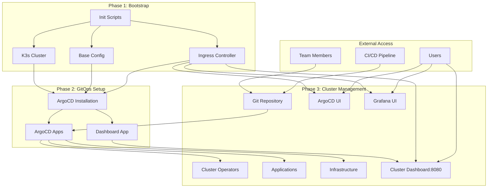

# K3s Cluster Management System Design

## Overview

The K3s Cluster Management System is designed as a three-phase evolution: initial cluster bootstrapping, ArgoCD integration, and ongoing GitOps-based administration. The system uses a monorepo structure that transforms from simple initialization scripts to a comprehensive cluster management platform.

## Architecture

### High-Level Architecture



### Repository Evolution Phases

1. **Bootstrap Phase**: Contains initialization scripts and basic cluster setup
2. **GitOps Integration Phase**: Adds ArgoCD and initial application definitions
3. **Administration Phase**: Full GitOps workflow with comprehensive cluster management

## Components and Interfaces

### 1. Bootstrap Components

#### Cluster Initialization Scripts
- **Purpose**: Automate K3s cluster setup and basic configuration
- **Location**: `/bootstrap/` directory
- **Key Files**:
  - `install-k3s.sh`: Main cluster installation script
  - `cluster-config.yaml`: K3s configuration template
  - `post-install.sh`: Post-installation validation and setup

#### Configuration Management
- **Purpose**: Manage cluster-wide settings and initial resources
- **Location**: `/bootstrap/configs/` directory
- **Components**:
  - Network policies
  - Storage classes
  - RBAC configurations
  - Security policies

### 2. ArgoCD Integration Components

#### ArgoCD Installation
- **Purpose**: Deploy and configure ArgoCD for GitOps management
- **Location**: `/argocd/` directory
- **Components**:
  - ArgoCD Helm chart values
  - Custom resource definitions
  - Initial application configurations
  - Authentication setup

#### Bootstrap Applications
- **Purpose**: Initial ArgoCD applications that manage cluster infrastructure
- **Location**: `/argocd/bootstrap-apps/` directory
- **Applications**:
  - Cluster operators management
  - Infrastructure components
  - Monitoring stack
  - Security tools
  - Cluster dashboard
  - Ingress controller

### 3. Cluster Management Components

#### Infrastructure as Code
- **Purpose**: Declarative cluster infrastructure management
- **Location**: `/infrastructure/` directory
- **Structure**:
  - `/base/`: Common configurations
  - `/overlays/`: Environment-specific customizations
  - `/operators/`: Cluster operator definitions

#### Application Management
- **Purpose**: Manage applications deployed to the cluster
- **Location**: `/applications/` directory
- **Structure**:
  - Application definitions
  - Helm chart configurations
  - Custom resources

#### Operator Management
- **Purpose**: Manage cluster operators and extensions
- **Location**: `/operators/` directory
- **Components**:
  - Operator installation manifests
  - Configuration templates
  - Dependency management

### 4. Dashboard and Ingress Components

#### Cluster Dashboard
- **Purpose**: Provide centralized cluster monitoring and application access
- **Location**: `/applications/system/dashboard/` directory
- **Components**:
  - Dashboard application deployment (based on Kubernetes Dashboard or similar)
  - Custom configuration for cluster health metrics
  - Service discovery integration for application links
  - Custom UI modifications and branding

#### Ingress Controller
- **Purpose**: Manage external access to cluster services with routing rules
- **Location**: `/infrastructure/base/ingress/` directory
- **Components**:
  - Ingress controller deployment (Traefik, NGINX, or similar)
  - SSL/TLS certificate management
  - Routing rules for all services
  - Load balancing and traffic management

## Data Models

### Cluster Configuration Schema
```yaml
cluster:
  name: string
  version: string
  network:
    cidr: string
    serviceCidr: string
  storage:
    defaultClass: string
  security:
    podSecurityStandard: string
    networkPolicies: boolean
```

### ArgoCD Application Schema
```yaml
apiVersion: argoproj.io/v1alpha1
kind: Application
metadata:
  name: string
  namespace: argocd
spec:
  project: string
  source:
    repoURL: string
    path: string
    targetRevision: string
  destination:
    server: string
    namespace: string
  syncPolicy:
    automated:
      prune: boolean
      selfHeal: boolean
```

### Operator Definition Schema
```yaml
operator:
  name: string
  namespace: string
  chart:
    repository: string
    name: string
    version: string
  values: object
  dependencies: array
```

### Dashboard Configuration Schema
```yaml
dashboard:
  name: string
  namespace: string
  port: 8080
  baseImage: string
  customizations:
    theme: object
    links: array
    metrics:
      enabled: boolean
      sources: array
  serviceDiscovery:
    enabled: boolean
    namespaces: array
```

### Ingress Configuration Schema
```yaml
ingress:
  controller:
    type: string # traefik, nginx, etc.
    namespace: string
  routes:
    - name: string
      host: string
      path: string
      service:
        name: string
        port: number
      tls:
        enabled: boolean
        secretName: string
```

## Error Handling

### Bootstrap Phase Error Handling
- **Validation Checks**: Pre-flight checks for system requirements
- **Rollback Mechanism**: Ability to clean up partial installations
- **Logging**: Comprehensive logging of installation steps
- **Health Checks**: Post-installation cluster health validation

### ArgoCD Integration Error Handling
- **Sync Failures**: Automatic retry with exponential backoff
- **Resource Conflicts**: Conflict detection and resolution strategies
- **Authentication Issues**: Clear error messages and troubleshooting guides
- **Repository Access**: Validation of Git repository connectivity

### Ongoing Operations Error Handling
- **Application Sync Issues**: Detailed sync status reporting
- **Operator Failures**: Health monitoring and alerting
- **Resource Constraints**: Resource usage monitoring and alerts
- **Security Violations**: Policy violation detection and remediation

### Dashboard and Ingress Error Handling
- **Dashboard Connectivity**: Health checks and automatic restart mechanisms
- **Service Discovery Failures**: Fallback mechanisms and error reporting
- **Ingress Routing Issues**: Traffic routing validation and failover
- **SSL Certificate Problems**: Automatic certificate renewal and validation

## Testing Strategy

### Bootstrap Testing
- **Unit Tests**: Individual script component testing
- **Integration Tests**: Full cluster installation validation
- **Environment Tests**: Multi-environment compatibility testing
- **Performance Tests**: Installation time and resource usage validation

### ArgoCD Integration Testing
- **Deployment Tests**: ArgoCD installation and configuration validation
- **Sync Tests**: Application synchronization testing
- **Authentication Tests**: User access and permission validation
- **Backup/Restore Tests**: ArgoCD configuration backup and recovery

### Cluster Management Testing
- **GitOps Workflow Tests**: End-to-end GitOps process validation
- **Operator Tests**: Cluster operator installation and functionality
- **Security Tests**: Security policy enforcement validation
- **Disaster Recovery Tests**: Cluster recovery and restoration procedures

### Dashboard and Ingress Testing
- **Dashboard Functionality Tests**: UI responsiveness and data accuracy validation
- **Service Discovery Tests**: Automatic application detection and link generation
- **Ingress Routing Tests**: Traffic routing and SSL termination validation
- **Load Balancing Tests**: Traffic distribution and failover testing

## Implementation Considerations

### Repository Structure
```
/
├── bootstrap/
│   ├── scripts/
│   ├── configs/
│   └── docs/
├── argocd/
│   ├── installation/
│   ├── bootstrap-apps/
│   └── configs/
├── infrastructure/
│   ├── base/
│   │   ├── ingress/
│   │   ├── security/
│   │   ├── storage/
│   │   └── rbac/
│   ├── overlays/
│   └── operators/
├── applications/
│   ├── system/
│   │   ├── dashboard/
│   │   └── monitoring/
│   └── workloads/
├── docs/
└── ci/
```

### Security Considerations
- **Secret Management**: Integration with external secret management systems
- **RBAC**: Comprehensive role-based access control
- **Network Security**: Network policies and service mesh integration
- **Image Security**: Container image scanning and policy enforcement

### Scalability Considerations
- **Multi-Cluster Support**: Design for eventual multi-cluster management
- **Resource Management**: Efficient resource allocation and monitoring
- **Performance Optimization**: Cluster performance tuning and optimization
- **Backup Strategy**: Comprehensive backup and disaster recovery planning

## Dashboard Implementation Strategy

### Base Dashboard Selection
The cluster dashboard will be built upon an existing open-source project with the following evaluation criteria:
- **Kubernetes Dashboard**: Official Kubernetes web UI with cluster overview capabilities
- **Lens Desktop**: Open-source Kubernetes IDE with dashboard features
- **Octant**: VMware's web-based Kubernetes dashboard
- **Headlamp**: Kinvolk's Kubernetes web UI

### Custom Dashboard Features
- **Cluster Health Overview**: Real-time node status, resource utilization, and pod health
- **Application Registry**: Automatically discovered services with direct access links
- **Quick Actions**: Common cluster operations accessible from the dashboard
- **Custom Branding**: Organization-specific theming and branding
- **Integration Points**: Direct links to ArgoCD, Grafana, and other monitoring tools

### Service Discovery Mechanism
- **Kubernetes API Integration**: Automatic discovery of services with specific annotations
- **ConfigMap-based Registry**: Manual service registration through configuration
- **Ingress Integration**: Automatic detection of ingress-exposed services
- **Health Check Integration**: Service availability validation before link display

## Ingress Implementation Strategy

### Ingress Controller Selection
Primary consideration for K3s compatibility:
- **Traefik**: Default K3s ingress controller with automatic SSL
- **NGINX Ingress**: Industry standard with extensive configuration options
- **Istio Gateway**: Service mesh integration for advanced traffic management

### Routing Strategy
- **Path-based Routing**: `/argocd/*`, `/grafana/*`, `/dashboard/*`
- **Subdomain Routing**: `argocd.cluster.local`, `grafana.cluster.local`
- **Port-based Access**: Direct port access for development environments
- **SSL/TLS Management**: Automatic certificate provisioning and renewal